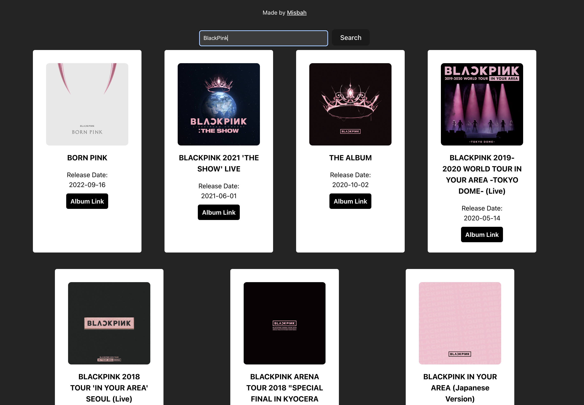

# Spotify Album Finder

A React-based web application that allows users to search for their favorite artists and discover their complete album discography using the Spotify Web API.



## About the Project

This application provides an intuitive way to explore any artist's album collection. Simply enter an artist's name, and the app will display all their albums with cover art, release dates, and direct links to listen on Spotify. Perfect for music enthusiasts who want to discover an artist's complete catalog or find that one album they've been looking for.

## Features

- 🔍 Search for any artist by name
- 📀 View complete album discography
- 🖼️ High-quality album cover art display
- 📅 Release date information
- 🎵 Direct links to albums on Spotify
- 📱 Responsive design for all devices

## Folder Structure

```
Spotify-Album-Finder/
├── public/
│   ├── demo.png              # Demo screenshot
│   ├── codedx-bot-logo.gif   # Favicon
│   └── vite.svg              # Vite logo
├── src/
│   ├── assets/
│   │   └── react.svg         # React logo
│   ├── App.jsx               # Main application component
│   ├── App.css               # Application styles
│   ├── index.css             # Global styles
│   └── main.jsx              # Application entry point
├── .eslintrc.cjs             # ESLint configuration
├── .gitignore                # Git ignore rules
├── index.html                # HTML template
├── package.json              # Project dependencies
├── package-lock.json         # Lock file
├── vite.config.js            # Vite configuration
└── README.md                 # Project documentation
```

## How to Run Locally

### Prerequisites

- Node.js (version 14 or higher)
- npm or yarn package manager
- Spotify Developer Account

### Setup Instructions

1. **Clone the repository**

   ```bash
   git clone https://github.com/MisbahAN/Spotify-Album-Finder.git
   cd Spotify-Album-Finder
   ```

2. **Install dependencies**

   ```bash
   npm install
   ```

3. **Set up Spotify API credentials**

   - Go to [Spotify Developer Dashboard](https://developer.spotify.com/dashboard)
   - Create a new app and get your Client ID and Client Secret
   - Create a `.env` file in the root directory:
     ```env
     VITE_CLIENT_ID=your_spotify_client_id
     VITE_CLIENT_SECRET=your_spotify_client_secret
     ```

4. **Start the development server**

   ```bash
   npm run dev
   ```

5. **Open your browser**
   - Navigate to `http://localhost:5173`
   - Start searching for your favorite artists!

### Build for Production

```bash
npm run build
```

## Technologies Used

### Core Technologies

- **React** - For building the user interface with component-based architecture
- **Vite** - As the build tool for fast development and optimized production builds
- **JavaScript (ES6+)** - For application logic and API interactions

### Styling & UI

- **React Bootstrap** - For responsive components and consistent styling
- **CSS3** - For custom styling and layout enhancements

### API Integration

- **Spotify Web API** - For fetching artist information and album data
- **Fetch API** - For making HTTP requests to Spotify endpoints

### Development Tools

- **ESLint** - For code quality and consistency
- **Environment Variables** - For secure API credential management

## Key Findings & Technical Decisions

### API Integration Strategy

- **Client Credentials Flow**: Used Spotify's client credentials grant for public data access, perfect for this read-only application
- **Token Management**: Implemented automatic token refresh on app initialization using React's `useEffect` hook

### Performance Optimizations

- **Efficient State Management**: Used React's `useState` for managing search input, access tokens, and album data
- **Responsive Design**: Leveraged Bootstrap's grid system for optimal display across all device sizes
- **Image Optimization**: Utilized Spotify's provided image URLs for high-quality album artwork

### User Experience Enhancements

- **Real-time Search**: Implemented Enter key support for quick searching
- **Visual Feedback**: Clean card-based layout with hover effects and consistent styling
- **External Links**: Direct Spotify integration allows users to listen immediately

## Author

**Misbah Ahmed Nauman**

- Portfolio: [MisbahAN.com](https://MisbahAN.com)
